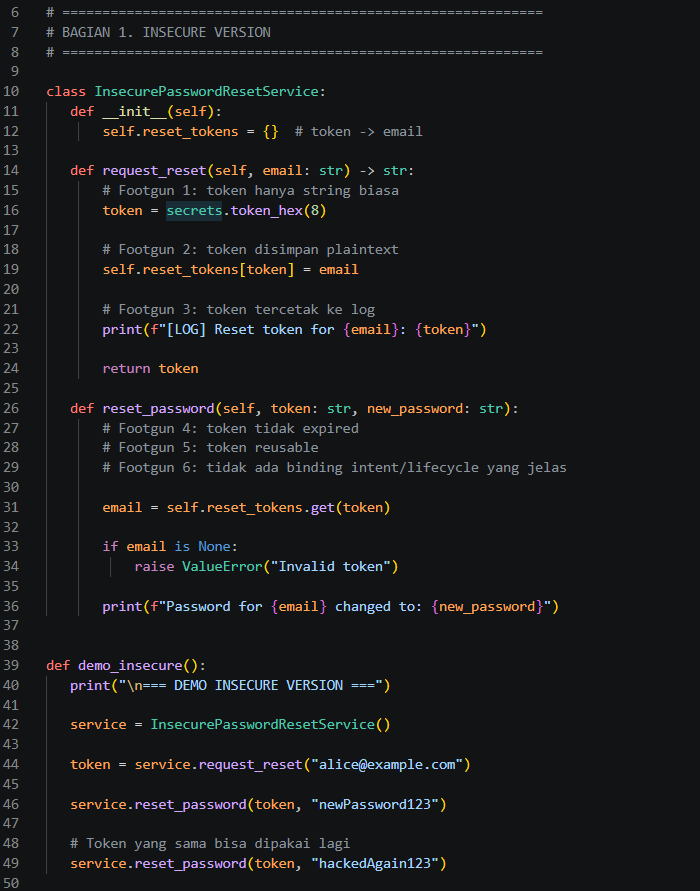
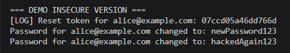
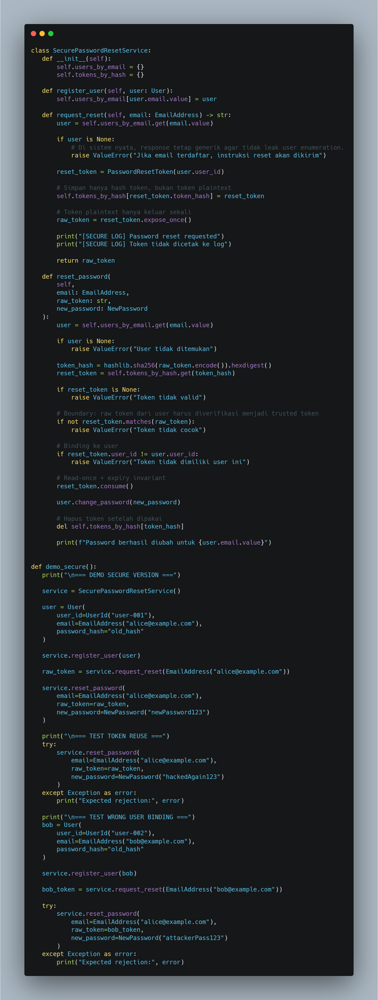
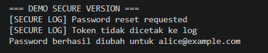
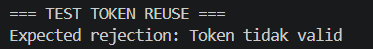
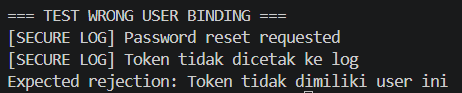

# Praktikum 5 - Password Reset Token Leak

## Tujuan

Mempelajari risiko kebocoran token reset password dan penerapan secure by design.

---

## Versi Insecure

### Screenshot Kode

### Screenshot Output

### Analisis

Masalah yang ditemukan:

1. Token disimpan dalam bentuk plaintext.
2. Token dicetak ke log.
3. Token tidak memiliki masa berlaku.
4. Token dapat digunakan berulang kali.
5. Tidak terdapat user binding.

---

## Versi Secure

### Screenshot Kode

### Screenshot Output

### Perbaikan

- Menggunakan secure random token.
- Menyimpan hash token.
- Menambahkan expiry time.
- Menerapkan read-once token.
- Menggunakan user binding.

---

## Test Token Reuse

### Hasil Pengujian

Output:

Expected rejection: Token tidak valid

### Analisis

Token yang sudah digunakan tidak dapat digunakan kembali sehingga mencegah replay attack.

---

## Test Wrong User Binding

### Hasil Pengujian

Output:

Expected rejection: Token tidak dimiliki user ini

### Analisis

Token reset password terikat pada pengguna tertentu sehingga tidak dapat digunakan untuk akun lain.

## Kesimpulan

Token reset password tidak boleh diperlakukan sebagai string biasa. Token harus memiliki lifecycle, ownership, dan aturan penggunaan yang jelas.
