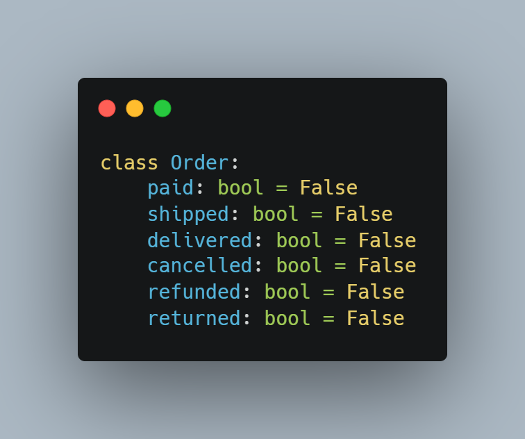
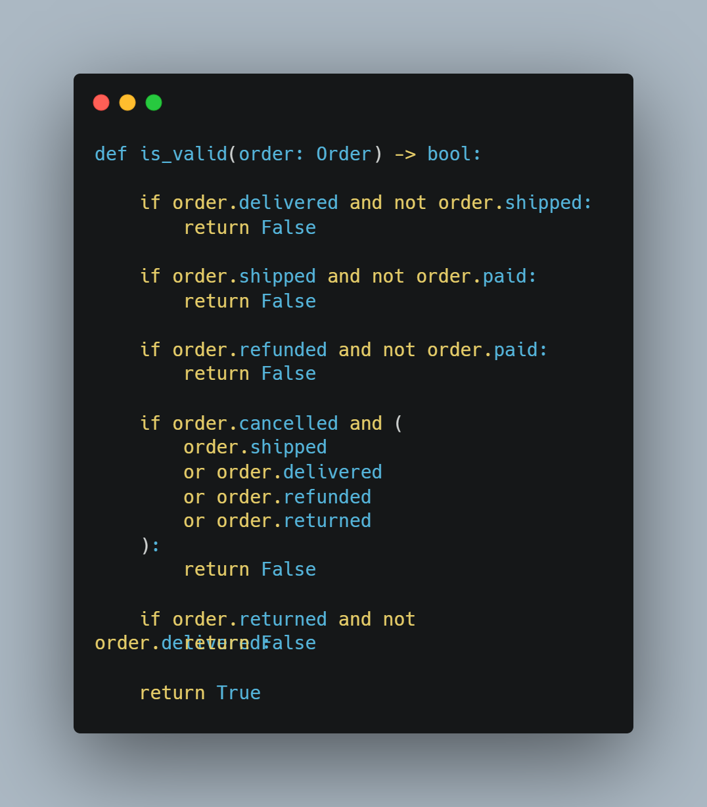
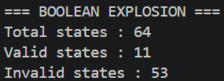
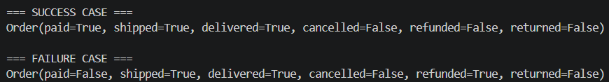

# 01. Boolean Explosion

## Tujuan

Memahami masalah Boolean Explosion akibat penggunaan banyak variabel boolean untuk merepresentasikan state bisnis.

## Struktur Order

## Validation Rules

## Hasil Eksekusi

## Success dan Failure Case

## Analisis

Program menghasilkan 64 kemungkinan state dari 6 variabel boolean. Namun hanya 11 state yang valid dan 53 state lainnya tidak valid. Kondisi ini menunjukkan bahwa semakin banyak boolean yang digunakan, semakin besar kemungkinan muncul kombinasi state yang tidak masuk akal.

## Kesimpulan

Boolean Explosion menyebabkan kompleksitas sistem meningkat dan berpotensi menimbulkan bug. Pendekatan yang lebih baik adalah menggunakan State Machine.
