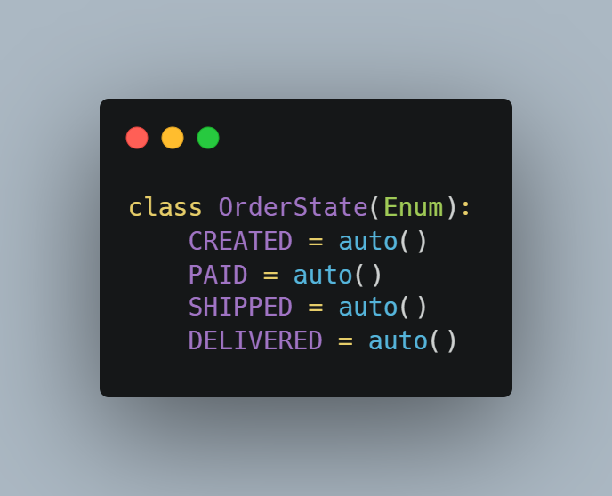
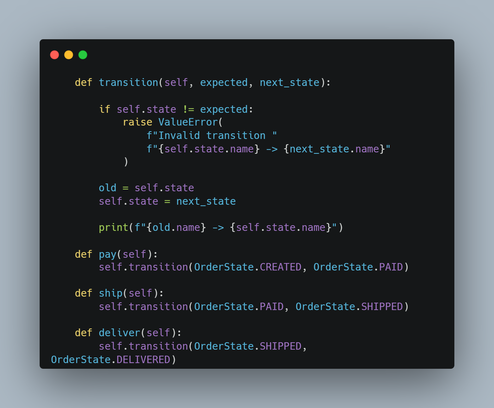
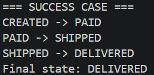
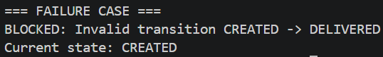

# 02. Secure State Machine

## Tujuan

Mengatasi masalah Boolean Explosion menggunakan State Machine.

## Enum State

## Transition Validation

## Success Case

## Failure Case

## Analisis

State Machine hanya mengizinkan perpindahan state yang valid. Pada pengujian, order berhasil berpindah dari CREATED ke PAID, SHIPPED, dan DELIVERED. Ketika mencoba langsung melakukan DELIVERED dari CREATED, sistem menolak operasi tersebut.

## Kesimpulan

State Machine mampu membatasi state yang valid sehingga lebih aman dan mudah dipelihara dibandingkan banyak variabel boolean.
