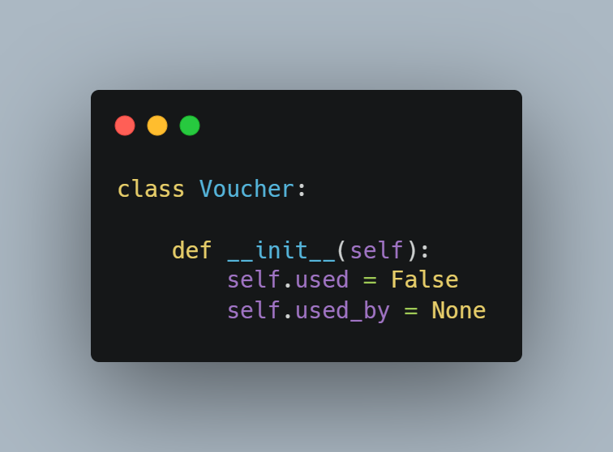
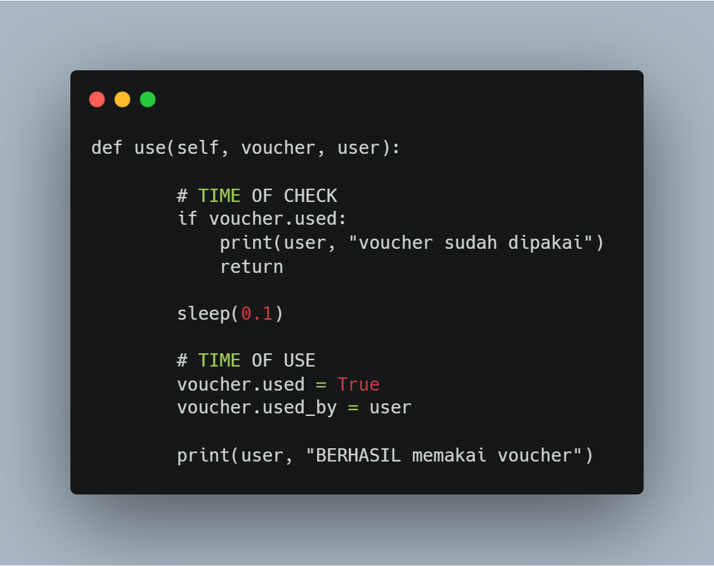
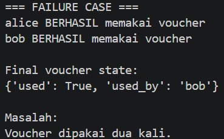

# 7C. Race Condition

## Tujuan

Memahami risiko Race Condition pada sistem yang diakses secara bersamaan.

## Implementasi

## Kode Race Condition

## Hasil Eksekusi

## Analisis

Dua thread melakukan pengecekan voucher secara bersamaan. Karena tidak ada mekanisme sinkronisasi, kedua pengguna berhasil menggunakan voucher yang sama.

## Kesimpulan

Race Condition dapat menyebabkan inkonsistensi data dan pelanggaran aturan bisnis.
