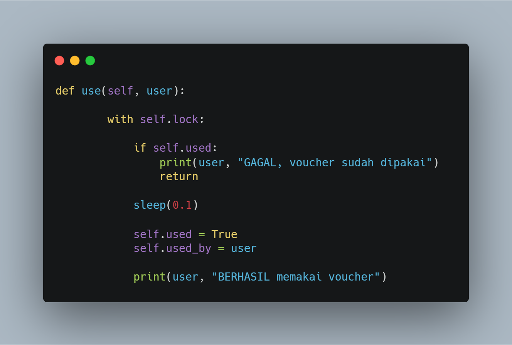
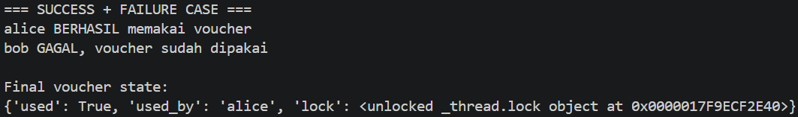

# 04. Atomic Transition

## Tujuan

Mencegah Race Condition menggunakan Lock.

## Implementasi Lock

## Hasil Eksekusi

## Analisis

Lock memastikan hanya satu thread yang dapat menggunakan voucher pada satu waktu. Akibatnya hanya satu pengguna yang berhasil, sedangkan pengguna lainnya ditolak.

## Kesimpulan

Operasi penting yang mengubah state harus dijalankan secara atomik untuk menjaga konsistensi data.
