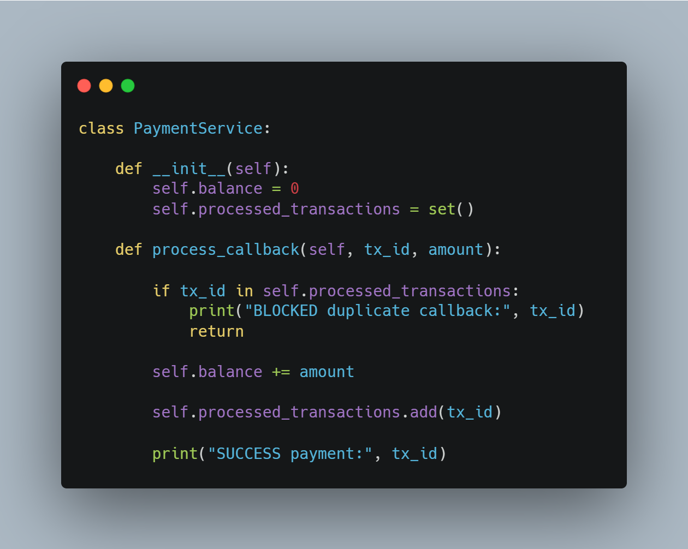
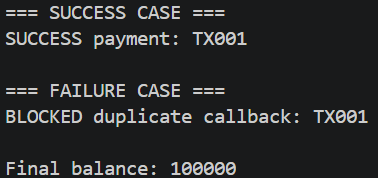

# 05. Idempotency Key

## Tujuan

Mencegah transaksi yang sama diproses lebih dari satu kali.

## Implementasi

## Hasil Eksekusi

## Analisis

Sistem menyimpan transaction ID yang telah diproses. Ketika callback yang sama dikirim kembali, transaksi langsung ditolak sehingga saldo tidak bertambah dua kali.

## Kesimpulan

Idempotency Key sangat penting pada sistem pembayaran untuk menghindari transaksi ganda.
