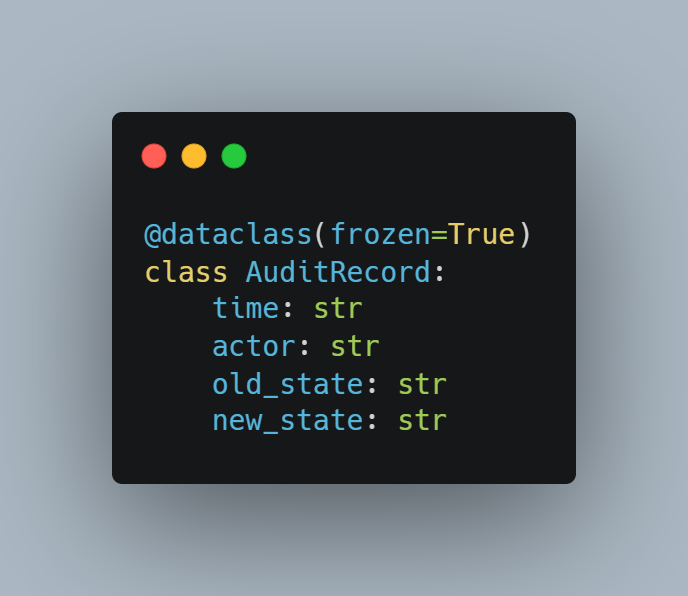
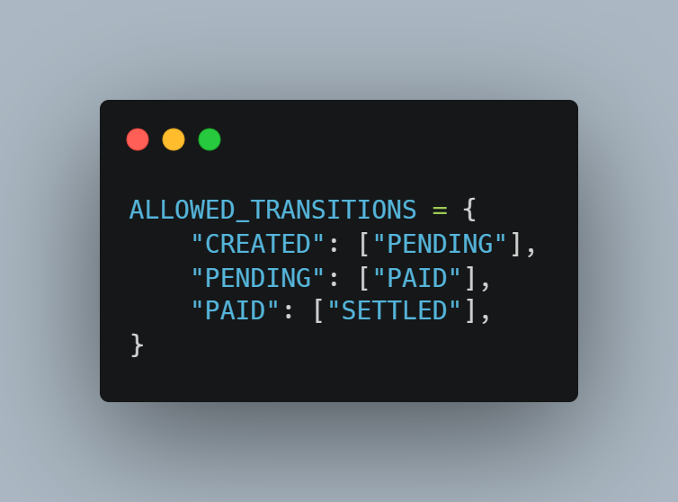
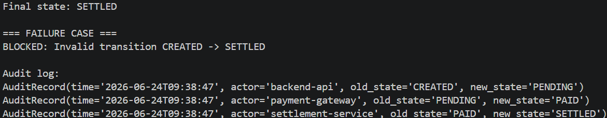

# 7F. Snapshot & Audit Trail

## Tujuan

Mencatat seluruh perubahan state agar dapat ditelusuri kembali.

## Audit Record

## Allowed Transition

## Audit Log

## Analisis

Setiap perubahan state menghasilkan catatan audit yang berisi waktu perubahan, aktor yang melakukan perubahan, state lama, dan state baru.

## Kesimpulan

Audit Trail meningkatkan transparansi dan memudahkan proses investigasi apabila terjadi masalah.
