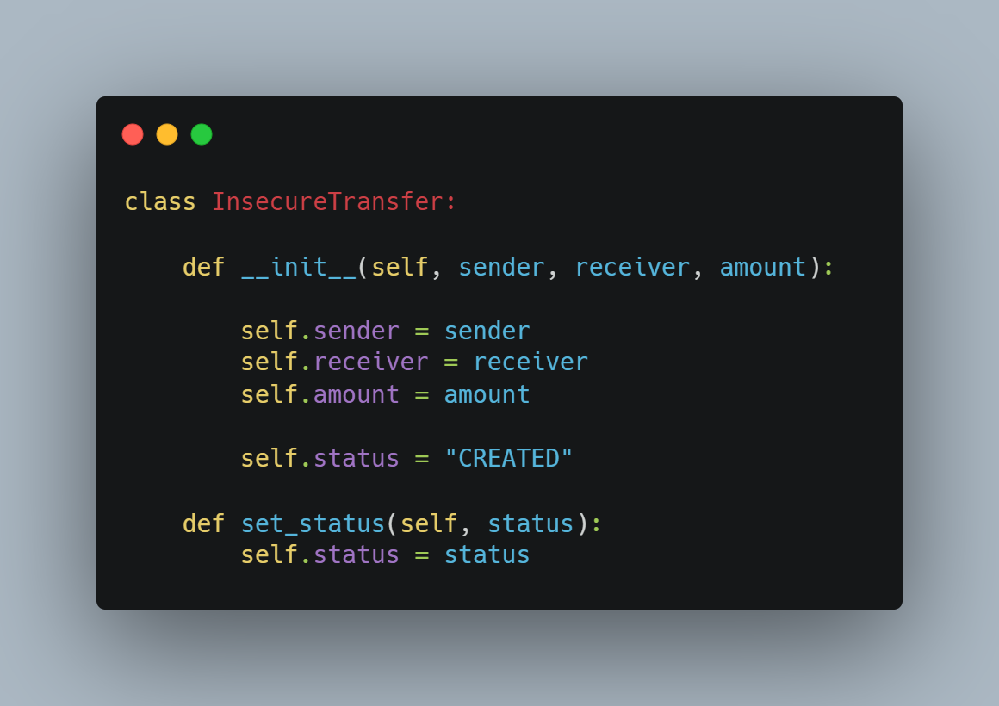
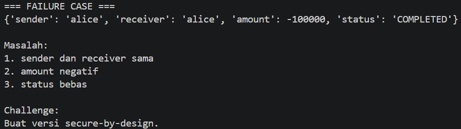

# 7G. Wallet Transfer Challenge

## Tujuan

Mengidentifikasi kelemahan desain pada proses transfer dana.

## Implementasi Insecure

## Hasil Eksekusi

## Masalah yang Ditemukan

1. Sender dan receiver dapat bernilai sama.
2. Amount dapat bernilai negatif.
3. Status dapat diubah bebas tanpa validasi.

## Risiko

- Manipulasi transaksi.
- Inkonsistensi data.
- Penyalahgunaan sistem.

## Solusi Secure-by-Design

- Validasi sender dan receiver berbeda.
- Validasi amount harus positif.
- Gunakan State Machine untuk status transaksi.
- Tambahkan Audit Trail.
- Gunakan Idempotency Key pada API.

## Kesimpulan

Validasi domain sejak awal dapat mencegah banyak kerentanan keamanan pada sistem keuangan.
